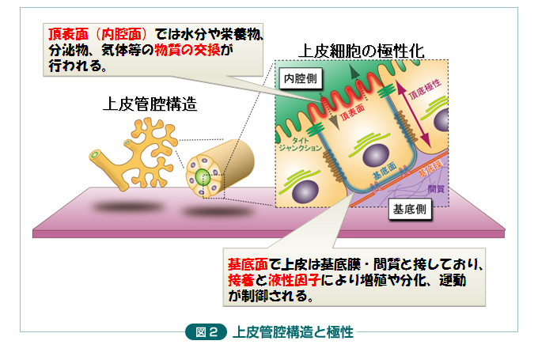
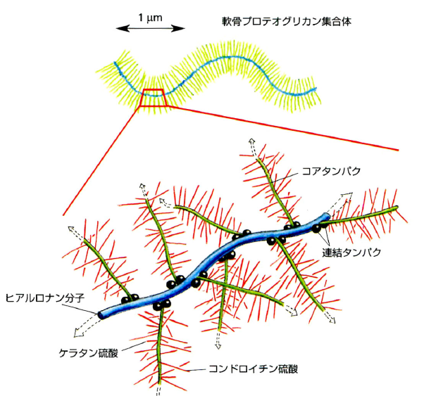

生命科学基礎第一2
# INDEX

- [INDEX](#index)
- [動物の組織と器官（19章）](#動物の組織と器官19章)
  - [上皮組織](#上皮組織)
  - [結合組織](#結合組織)
    - [結合組織の種類](#結合組織の種類)
  - [筋組織](#筋組織)
    - [骨格筋組織](#骨格筋組織)
    - [心筋組織](#心筋組織)
    - [平滑筋組織](#平滑筋組織)
  - [神経組織](#神経組織)

# 動物の組織と器官（19章）
一種類以上の細胞と細胞外基質によって**組織**が構成される．  
複数組織が集まって**器官**が構成される．  
組織は以下の４つに分類される．

## 上皮組織
$$上皮組織 = \{単層, 多層\} \times \{扁平, 円柱, 立方\}$$  
増殖が活発である．  
細胞間に細胞外基質を持たず，**細胞間接着**（**密着結合**，**ギャップ結合**，接着結合，デスモソーム結合）を有する．  
この際，細胞膜が以下の２種類に**区画化**される．  
- **頂端膜**（管腔側）
- **側底膜**（隣接細胞側の側膜と基底膜の総称）  

上皮組織が分泌した物質が，下の結合組織と接着させる非細胞性の**基底膜**を形成．  
上皮細胞には**極性**（表裏）があり，**自由表面**と**基底膜**に分かれる．  

- 単層扁平：物質の拡散，輸送（**能動輸送**，**受動輸送**）  
    輸送上皮細胞はミトコンドリアが豊富であり，運ばれた栄養を好気呼吸などに利用している．  
- 多層扁平：保護  
- 円柱，立方：吸収，分泌  

>[!NOTE]
>うち**繊毛**や**微絨毛**を持つものがある．  
>微絨毛：上皮表面の突起，表面積増大による物質の吸収  
>うち**腺**という構造を持つものがある．
>- 外分泌腺：分泌物を内表面・外表面に運ぶ管を持つ．  
>- 内分泌腺：ホルモンを分泌．管を持たず，血液中に放出．

腫瘍のうち上皮性の悪性腫瘍を**がん**や**がん腫瘍**と呼ぶ．  

## 結合組織
細胞は互いに接着しておらず，その周囲に細胞外基質が存在する．  
細胞外気質には**繊維芽細胞**が存在し，細胞外基質を分泌する．  
線維芽細胞は骨細胞，骨芽細胞，脂肪細胞，平滑筋細胞，軟骨細胞に分化可能である．　　

細胞外基質に含まれるもの  
- **コラーゲン繊維**：約20種類，哺乳動物全たんぱく質の25%を占める．
- **弾性繊維（エラスチン）**：コラーゲンより弾性がある
- **プロテオグリカン，グリコサミノグリカン**：巨大な集合体を作る

- **細胞接着分子**

### 結合組織の種類
- **軟性結合組織**
  - 疎性結合組織：上皮を裏打ちし構造を支持する．ゲル状の細胞外基質で満たされており，これが体液の貯蔵に役立つ．
  - 密性結合組織：組成結合組織よりも細胞外基質が少なく，より強靭である．  
    密性結合組織はさらに以下の２つに分類できる．  
    - 密性規則結合組織：平行に密集した繊維束の中に線維芽細胞が規則正しく並ぶ．これにより，伸縮時に組織が裂けることを防いでいる．
    - 密性不規則結合組織：皮膚の深部を構成する．
- **軟骨**：**軟骨細胞**と特殊な細胞外基質から成る．  
  **95%** 以上が2型コラーゲンとプロテオグリカンの細胞外基質である．
- **脂肪組織**：**脂肪細胞**から成る．脂肪細胞だけが多量の脂肪を蓄えることができ，そのために核などの細胞要素が一方に押しやられている．  
主な機能は**エネルギー貯蔵**である．細胞内で**トリアセシルグリセロール（TG）** を合成・貯蔵する．空腹時にTGを**脂肪酸**と**グリセロール**に変換して血中に放出することにより，心臓や脳の栄養源としている．  
- **骨組織**：カルシウムとリンで**石灰化**された細胞外基質により細胞が囲まれている．
  - 骨芽細胞：骨を生成する中心部．骨基質（1型コラーゲン）を活発に分泌する．
  - 骨細胞：骨の全細胞の**90-95%**．
  - 破骨細胞：骨基質を分解・吸収する．
- ~~血液~~

## 筋組織
### 骨格筋組織
細胞質が融合して多核化した**筋繊維**が平行に並ぶ．これが縞模様に見えるため**横紋筋**と呼ばれる．骨格筋は運動神経により制御されており，意識的に動かせるので**随意筋**に分類される．

### 心筋組織
心筋細胞は枝分かれがあり，単核である．心臓の絶え間ない収縮が一定のATPを必要とするので，多くのミトコンドリアを含む．心筋細胞も平行に並ぶため**横紋筋**である．  
心筋は**不随意筋**であり，心筋細胞がペースメーカーとして働くことにより収縮している．  
心筋細胞間の**ギャップ結合**により電気シグナルの伝達を可能にしている．

### 平滑筋組織
平滑筋細胞はその両端が細い形状をしており，単核である．また，縞模様がない．  
腸の内容物運搬や血管の内径変化による血液運搬などを担う**不随意筋**である．  
心筋組織に比べ，緩やかな収縮に適している．心筋組織と同様にギャップ結合により，電気シグナルが伝達されている．

## 神経組織
**神経細胞（ニューロン）** と**神経支持細胞**から成る．
